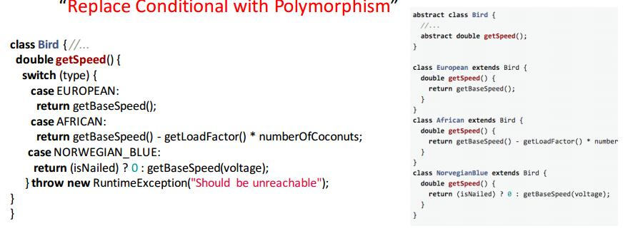

# Refactoring

Changing software in such a way that does not affect functionality of the program, but improves structure and maintainability of the software.

## Refactoring Today

- Pretty much all IDEs have refactoring tools built in
- Empirical studies show that practitioners still like to refactor manually (tools are hard to learn)
-  Current refactoring tools cannot absolutely guarantee semantic preservation. Therefore, refactoring goes hand in hand with unit testing.

## Two phase development cycles

- Iterative development

```
Expansion -------> Refactor
    ^                 |
    |_________________|
```
In expansion phase, don't worry about prettiness, you will refactor in the refactor phase.

## What to Refactor

- __Bloaters__
    - Long Methods
        - Extract methods of similar operations remove temp varibles is possible
        
    - Large Classes
        - Extract Classes
        - Extract Sub Classes
        - Extract Interfaces
        - Replace Parameter With Method Call
            - Put a object that is used to calculate external parameters into the function call
            
    - Primitive Obsession
        - Replace	Type Code	with	Class
            - replace primative values with Classes
            
    - Long Parameter List
        - Introduce Parameter Object
            - Make a new object that is used to pass in long parameter lists
            
        - Replace	DataValue	with Object
            - make a new object to encapsulate some of the functionality
    - Data Clumps (some data always used together)
- Object Oriented Abusers
    - Dont use switch statements in object oriented programming
    
